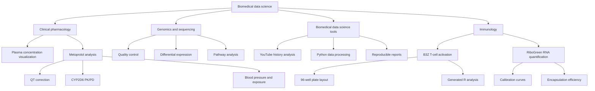

# Biomedical Data Science Projects

An online portfolio of biomedical data-analysis projects from my studies,
research work and personal work. Projects are organised by subject.

## Featured projects

Start here if you are reviewing this repository:

| Project | Why it is useful | Stack |
| --- | --- | --- |
| [Plasma concentration visualization](projects/clinical-pharmacology/plasma-concentration-visualization/README.md) | Interactive exploration of repeated dosing, missed doses, and double doses | React, JSX, Recharts, Vite |
| [Metoprolol analysis](projects/clinical-pharmacology/metoprolol-analysis/README.md) | Primary QTcF analysis with related PK/PD subanalyses | R, mixed-effects models, ECG and exposure-response methods |
| [YouTube Video Analysis](projects/youtube-video-analysis/README.md) | Extract and analyse viewing-history data to generate a PDF report | Python, Google API, FPDF |
| [B3Z T-cell activation configurator](projects/immunology/t-cell-activation/README.md) | Configure a 96-well assay and generate reproducible R analysis code | React, JSX, R, plate assays |
| [RiboGreen assay configurator](projects/immunology/RiboGreen-analysis/README.md) | Configure RNA quantification and encapsulation-efficiency analysis | React, JSX, R, fluorescence assays |

The featured order reflects the intended review path: interactive work first,
then a complete statistical analysis, then a focused clinical interpretation.

## Project map



## Explore the projects

### Clinical pharmacology

Projects using R and React for clinical pharmacology, pharmacokinetics,
pharmacodynamics, ECG measurements, and exposure-response analysis.

- [Clinical pharmacology projects](projects/clinical-pharmacology/README.md)

### Genomics and sequencing

The sequencing section is ready for future R and Bioconductor projects.

- [Genomics and sequencing projects](projects/genomics-sequencing/README.md)

### Biomedical data science tools

Projects using Python for data processing, API integration, testing, and
reproducible report generation.

- [YouTube video analysis](projects/youtube-video-analysis/README.md)

### Immunology

Interactive tools for immune-cell assays and reproducible plate-based analysis.

- [B3Z T-cell activation configurator](projects/immunology/t-cell-activation/README.md)
- [RiboGreen assay configurator](projects/immunology/RiboGreen-analysis/README.md)

## Repository structure

```text
projects/
├── clinical-pharmacology/
│   ├── README.md
│   ├── plasma-concentration-visualization/
│   └── metoprolol-analysis/
│       ├── README.md
│       ├── metoprolol.r
│       ├── qt-correction/
│       ├── cyp2d6-pkpd/
│       └── systolic-bp-concentration/
├── genomics-sequencing/
│   └── README.md
├── immunology/
│   ├── README.md
│   ├── t-cell-activation/
│   │   ├── README.md
│   │   └── T-cell-activation.jsx
│   └── RiboGreen-analysis/
│       ├── README.md
│       └── RiboGreen-assay-script.jsx
└── youtube-video-analysis/
    ├── README.md
    ├── project.py
    ├── jsonify.py
    └── test_project.py
```

Each project should include a short overview, the research or analytical
question, methods, a reproducible entry point, and a brief summary of results.
Sensitive or identifying data should never be committed to this repository.

## Status

This portfolio is being built incrementally as analyses are cleaned up and
made suitable for public release.
