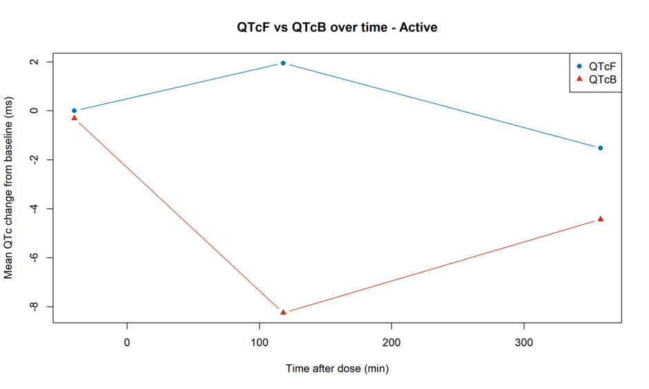

# Clinical Pharmacology Projects

This section contains R analyses of clinical and pharmacological data, such as
pharmacokinetics, pharmacodynamics, ECG measurements, treatment effects, and
exposure-response relationships.

## Projects

| Project | Focus | Methods | Status |
| --- | --- | --- | --- |
| [Plasma concentration visualization](plasma-concentration-visualization/README.md) | Interactive repeated-dose concentration profiles | React, JSX, Recharts, Vite | Runnable app |
| [Metoprolol analysis](metoprolol-analysis/README.md) | QT, PK/PD, CYP2D6 and blood-pressure analyses | R, mixed-effects models, ECG and exposure-response methods | Analysis collection |

## Project details

## Level 1 projects

### Plasma concentration visualization

This React application explores repeated-dose plasma concentration profiles,
including missed and doubled doses, using synthetic pharmacokinetic parameters.

- [Project README](plasma-concentration-visualization/README.md)
- [React component](plasma-concentration-visualization/src/PlasmaConcentrationChart.jsx)

### Metoprolol analysis

This level-1 project contains the primary metoprolol analysis and its related
clinical pharmacology subanalyses.

- [Metoprolol analysis README](metoprolol-analysis/README.md)
- [Primary QTcF script](metoprolol-analysis/metoprolol.r)

#### Subanalyses

##### QT correction: QTcF and QTcB

This analysis explains the difference between Fridericia correction (QTcF) and
Bazett correction (QTcB), and why QTcF is preferable when metoprolol changes
heart rate. The accompanying figure summarises the correction comparison.

- [QT correction README](metoprolol-analysis/qt-correction/README.md)

##### CYP2D6-stratified PK/PD analysis

This analysis compares pharmacokinetic exposure and pharmacodynamic responses
between Extensive, Intermediate, and Slow CYP2D6 phenotypes. Because the Slow
group contains one participant, the three-level result is descriptive; the
main inferential comparison combines Intermediate and Slow participants into a
Reduced group.

- [CYP2D6 PK/PD README](metoprolol-analysis/cyp2d6-pkpd/README.md)

##### Systolic blood pressure versus concentration

This script explores the relationship between plasma concentration and supine
systolic blood-pressure change. It produces an active-arm mean concentration
response plot and participant-level profiles.

- [Blood-pressure analysis README](metoprolol-analysis/systolic-bp-concentration/README.md)

## Reproducibility notes

The scripts expect `AnalysisSet.Rdata` in the working directory and may create
an `output/` directory containing tables, figures, diagnostics, and session
information. The dataset and generated output are intentionally not included
in this public repository.

## Important

The analysis requires `AnalysisSet.Rdata`, which is intentionally not included
in this public repository as it contains personal data.